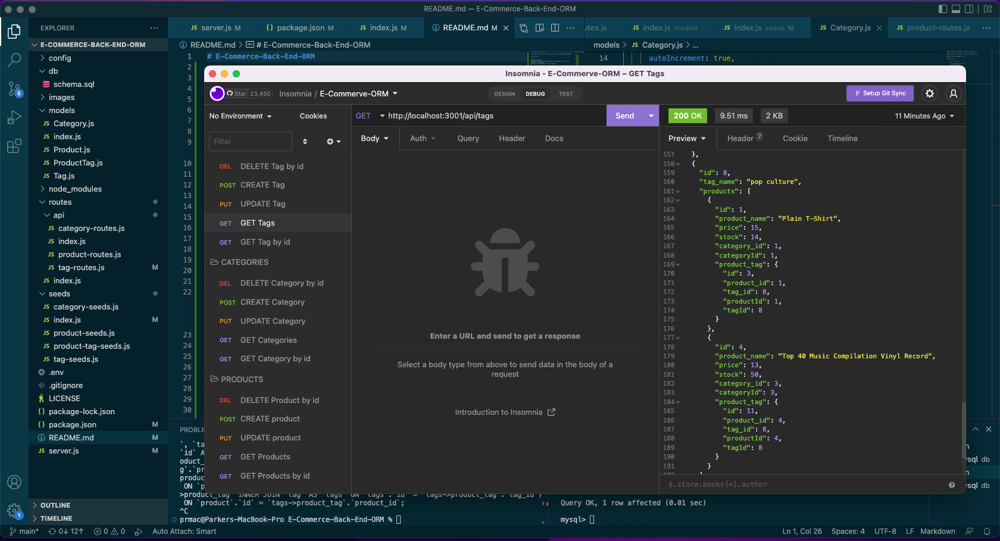

# E-Commerce-Back-End-ORM


## Description

```md
AS A manager at an internet retail company
I WANT a back end for my e-commerce website that uses the latest technologies
SO THAT my company can compete with other e-commerce companies
```

## Table of Contents

- [Installation](#installation)
- [Usage](#usage)
- [Credits](#credits)
- [License](#license)

## Installation

The first step is to get into mysql. Then you want to SOURCE the schema and then run nppm run seed in the db folder (in that order). You can go into the main branch now and run npm start. This will start the application so you can go into insomnia to use the different commands (PUT, POST, DELETE, and GET).

## Usage

Follow steps for installation and follows prompts to your desire



[Screen recording of using GET](https://drive.google.com/file/d/10ujIH6u5udVX_3fxOWWuXWH7LAhmZBJL/view?usp=sharing "Screen recording of using file")

[Screen recording of using POST, PUT, and DELETE](https://drive.google.com/file/d/15x6WOFQTAJDfb4N8E6Lg_69tczEXfdOV/view?usp=sharing "Screen recording of using file")

## License

MIT

## Contributing

I used too many too list. MDN is a great resource as well ads this past week's assignments. Google was a great tool that I love to use as well.

## Questions

GitHub username: Priddle88

GitHub profile: [Link to Profile](https://github.com/Priddle88)

Reach out to parkerriddle09@gmail.com (with your first name included) if you have any questions!
